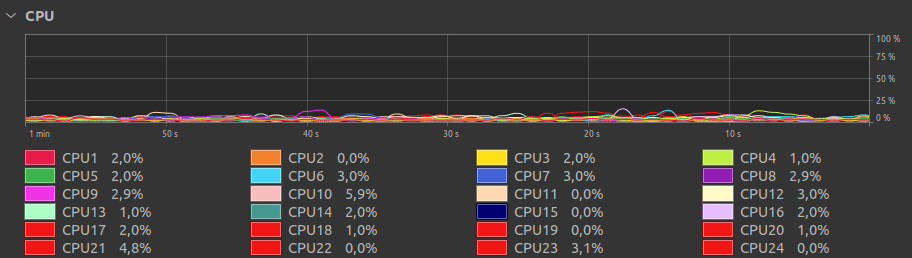

# How to reason about numerical code optimization on modern processors - Part 4 : Loops, Load Balancing and Symmetrization

​	We finally reach the final part of this series. In the previous parts we covered how to use better algorithms to calculate the same quantity of interest smartly, we improved upon it by parallelization, vectorization and compiler flags. This already provided us with very large performance gains, but it is not yet all it could be. In this part we will present some more advanced optimization techniques, which involve exploiting some features of modern computer architectures that are usually handled beneath the overall thought process in most programs. 

​	This will require thinking out how our program plays out in real hardware, and how choices for expressing abstractions translate into code and impact the actual execution of the finished program. We will cover openMP `#pragma omp parallel for` placement, how to re-think the parallelized loop in order to expose parallelism and increase core utilization and how to exploit some minor features in the way data and operations of this particular problem behave.

​	Any and all of these optimization can fly under the radar if you are not aware of them, which is specially common because it is not something that is usually brought up in early parallel computing lessons and courses. Bringing them to bear in this code will enable us to bring another factor of $5\times$ to $10\times$ speedup over all the previous results, which is astounding considering how much performance we have already been able to extract. 

​	We close the series with a recap of all the lessons learned in improving this code, both about that should be done and what shouldn't be done, regarding each step taken to improve the code performance. After that, we provide a glimpse of what is beyond the topics covered in this series, including GPGPU computing and distributed computing with MPI.

​	Similarly as done with the previous parts, we present a summary of the results of this part in comparison with the previous ones:

|          Algorithm / Implementation / Configuration          |  Time (Seconds)  | Speedup (Rel. to slowest) |
| :----------------------------------------------------------: | :--------------: | :-----------------------: |
| Naive Calculation (i.e. direct two loop) / AoS, simple, no optimizations / gcc -std=c11 -Wall |  188.46 +- 0.71  |          **1 x**          |
| Cell Linked List / AoS, simple, no optimizations / gcc -std=c11 -Wall | 3.642  +- 0.043  |         **51 x**          |
| Naive Calculation (i.e. direct two loop) / SoA, OpenMP / gcc -std=c11 -Wall -O3 |  4.267 +- 0.049  |         **44 x**          |
|   Cell Linked List / SoA, OpenMP / gcc -std=c11 -Wall -O3    |  0.313 +- 0.033  |         **600 x**         |
| Naive Calculation / SoA, OpenMP, SIMD / gcc -std=c11 -O3 -ffast-math -march=native | 0.7507 +- 0.0018 |         **251 x**         |
| CLL / SoA, Outer Loop OpenMP, SIMD / gcc -std=c11 -O3 -ffast-math -march=native | 0.0412 +- 0.0003 |        **4574 x**         |
| CLL / SoA, Load Balanced OpenMP, SIMD / gcc -std=c11 -O3 -ffast-math -march=native | 0.0307  +- 0.001 |        **6138 x**         |
| CLL / SoA, Symmetrical LB OpenMP, SIMD / gcc -std=c11 -O3 -ffast-math -march=native | 0.0236 +- 0.0006 |        **7985 x**         |
| CLL / SoA, SymmLB OpenMP, CountSort SIMD / gcc -std=c11 -O3 -ffast-math -march=native | 0.0193 +- 0.0021 |        **9764 x**         |

## OpenMP: A practical guideline 

​	We extracted quite a bit of performance from SIMD by using `#pragma omp simd` and with associated compiler flags, and now we turn to improving the way threads are being used. As mentioned before launching threads is not free, and to the extent that it is possible we want for them to live as long as possible and to do the most work as possible before being shut down. 

​	In the sections below we will explore ways to better utilize the threads by more smartly splitting the load for them to work on. We will cover three major topics: Where to parallelize, how to improve data re-use and how to split the workload.

### Cost management for Threads: Parallelize Outside

​	As it was mentioned before, the easiest way to parallelize was to copy the `#pragma omp parallel for` from the naive case to its respective place in the `compute_density_3d_chunk` function, therefore the parallelization was being done at the level of a given particle calculation. Conceptually this is good, but at the implementation level this means that the threads must be launched and joined as many times as this function is called, which correspond to the number of cell pairs, i.e. once for each valid neighbor cell `nblist[j]>=0` corresponding to each box, which in our case sums up to $21232$ cell pairs.

​	Even **if** the cost of launching the threads was very small, launching them over 20.000 times is bound to have a hit in our performance. For it not to be the case, the time for launching threads should be of the order $10\% \times 0.17\ \mbox{s}\times 1/21232 \approx 0.8 \mu \mbox{s}$ or below, which is a very small number and [totally not the case](https://stackoverflow.com/questions/44097890/openmp-parallel-for). Launching parallel for for only 8 threds can have an overhead over $70\ \mu \mbox{s}$ , as can be seen in the chart below, which is much higher then what we would estimate to be necessary for not impact our performance. Also, this problem **only gets worse** as the problem size rises since the number of threads launches **increase** with the number of available cells. This latency calculation problem is so common that you can find site like ["Latency Numbers Every Programmer Should know"](https://colin-scott.github.io/personal_website/research/interactive_latency.html), I suggest you take a look in not only today's latencies, but also how they evolve along time, which can be seen by moving the bar in the link.

​	

​	The first improvement, therefore, is to move the openMP launch to a point where up in the hierarchy of nested loops, up and out. In our first attempt, I moved from the third inner loop to the outer-most loop, which iterate over the cells. Inside it, each thread will compute the neighbor list over which iterate and compute the contributions from neighboring cells to the cell it is assigned to. The resulting code can be seen below:

```C
int compute_density_3d_outerOmp(int N, double h, SPHparticle *lsph, linkedListBox *box){
  memset(lsph->rho,(int)0,N*sizeof(double));                            // Pre-initialize the density to zero

  #pragma omp parallel for                                              // Execute the iteration in parallel
  for (khint32_t kbegin = kh_begin(box->hbegin); 
       kbegin != kh_end(box->hbegin); kbegin++){                        // Iterate over each receiver cell begin index 
    int64_t node_hash=-1,node_begin=0, node_end=0;                      // Start initializing the node indexes on the array 
    int64_t nb_begin= 0, nb_end = 0;                                    // initialize the neighbor indexes 
    int64_t nblist[(2*box->width+1)*(2*box->width+1)*(2*box->width+1)]; // prepare a list of potential neighbor hashes

    if (kh_exist(box->hbegin, kbegin)){                                      // verify if that given iterator actually exists
      khint32_t kend = kh_get(1, box->hend, kh_key(box->hbegin, kbegin));    // Then get the end of the receiver cell iterator

      node_hash = kh_key(box->hbegin, kbegin);                               // Then get the hash corresponding to it
      node_begin = kh_value(box->hbegin, kbegin);                            // Get the receiver cell begin index in the array
      node_end   = kh_value(box->hend, kend);                                  // Get the receiver cell end index in the array

      neighbour_hash_3d(node_hash,nblist,box->width,box);                      // then find the hashes of its neighbors 
      for(int j=0;j<(2*box->width+1)*(2*box->width+1)*(2*box->width+1);j+=1){  // and the iterate over them 
        if(nblist[j]>=0){                                                      // if a given neighbor actually has particles
          nb_begin = kh_value(box->hbegin, kh_get(0, box->hbegin, nblist[j]) );// then get the contributing cell begin index
          nb_end   = kh_value(box->hend  , kh_get(1, box->hend  , nblist[j]) );// and get the contributing cell end index 

          compute_density_3d_chunk_noomp(node_begin,node_end,nb_begin,nb_end,h,// and compute the density contribution from 
                               lsph->x,lsph->y,lsph->z,lsph->nu,lsph->rho);    // the contributing cell to the receiver cell
   }}}}

  return 0;
}
```

​	We can observe that `#pragma omp parallel for` is in the outer-most loop, which means that it will only be called once therefore lowering the total thread launch overhead. Also all variables that used to be at the start of the function were moved inside the outer-most loop. This is done to indicate to openMP that these variables are **private** to each thread, so they are to be replicated by each thread and only modified locally. An alternative to moving the variables inside the loop is to write a `private` clause in the `#pragma omp parallel for`, such as `#pragma omp parallel for private(nblist,node_begin,node_end)`. 

​	The performance results are encouraging: 

|          Algorithm / Implementation / Configuration          |  Time (Seconds)  | Speedup (Rel. to slowest) |
| :----------------------------------------------------------: | :--------------: | :-----------------------: |
| Cell Linked List / AoS, Outer Loop OpenMP, SIMD / gcc -std=c11 -O3 -ffast-math -march=native | 0.1762 +- 0.0066 |        **1069 x**         |
| Cell Linked List / SoA, Outer Loop OpenMP, SIMD / gcc -std=c11 -O3 -ffast-math -march=native | 0.0412 +- 0.0003 |        **4574 x**         |

​	Just by moving the openMP loop up we managed to gain considerable performance in the Cell Linked List version, corroborating our first impression regarding the cost of repeatedly creating threads. Though this makes it much closer to the expected speedup, this is not yet all it could be, but it quite a bit better than it was. This also showcases what is it not simply a matter of "calling the threading library" that will allow us to extract maximum performance, but also how and where it is called. Understanding that there are costs, beside benefits, related to running in parallel is key to write good parallel code. 

​	The main lesson from this section is: **All resources have a cost, don't overpay for them, think carefully how and where threads are being used**.

## Improving on OpenMP: Load Balancing  and  Exposing Hidden Parallelism

​	As up to this point, the performance of the Cell Linked List version of the calculation has been quite satisfactory, but not yet all it could be. The reason for this is that the initial $52\times$ speedup we observed when doing the very first part of this series, relative to the corresponding naive implementation, has not been recovered since introducing implementation optimizations, such as openMP parallelism and vectorization. Though not always, this is sometimes an indication that  there is some sub-optimal implementation around somewhere, which is our job to find. 

​	In this last case, I actually stumbled into the problem using a 'unconventional' profiling: I watched linux system monitor while runing my program, and the result looked like this:


​	Though unconventional, it is not too (spiritually) different of what is done in proper profiling software, like Intel VTune profiler, which would be **correct** way to do, if only I had the budget for it. 

​	You will notice that all threads rise together, for this bigger $N=10^7$ case, and basically drop one by one till there is only one last trailing core doing calculations, and then it finally stops. This shows in a pretty visual way to see what **load imbalance** looks like. Load imbalance is one of the major problems with parallelizing very complex problems, specially as the number of cores increases. The issue is the following. If there are $N_{\rm tasks}$ independent tasks of same computational execution time $t_i = T/N_{\rm tasks}$ , the total time is $T = t_0 + t_1 + t_2 + ... + t_{N_{\rm tasks}}$   , and dividing them among $N_{\rm cores}$ cores can have a potential speedup of up to:
$$
\frac{T}{t_0+t_1+...+t_{N_{\rm tasks}/N_{\rm cores}}} = \frac{N_{\rm tasks}}{(N_{\rm tasks}/N_{\rm cores})}\approx N_{\rm cores}
$$
​	because an equal number of tasks would be handled to each core, which should take the same amount of time. Since the computational is only done when **every part of it is done**, when all cores finishes we get our speedup. 

​	When the costs $c_i$ are not equal, the situation is much more complicated. Each core $c$ receives a list of tasks $I_c = \{i_{c_0},i_{c_1},...,i_{c_k}\}$to execute, which need not have **the same number of tasks for each core**. Since the computational is only done when **every part of it is done**, this means that to compute the speedup we need to compute the biggest time any given core took to complete all tasks, i.e. the time of **the most laggard core**.  The new speedup comes down to a similar computation as before:
$$
\frac{T}{\max_{c\ \in\ {\rm Cores}} \sum_{i \in I_c} t_c} = \frac{T}{\max_{c\ \in\ {\rm Cores}} T_c} \leq N_{\rm cores}
$$
​	The best case scenario is that we get a linear speedup, but any work imbalance damages us because **if one core finishes earlier, it sits idle**. Choosing an optimal distribution of work can be very hard, with a whole [discipline of research](https://en.wikipedia.org/wiki/Load_balancing_(computing)) dedicated to studying it. Even if it is possible to improve somewhat the distribution of work my smartly spliting the task, it might be the case there simply is some residual imbalance to deal with. 

​	In our case, the work imbalance comes from the way each thread find which work to do. In our case, the interior of the parallelized loop contain the following section:

```c
      neighbour_hash_3d(node_hash,nblist,box->width,box);                      // then find the hashes of its neighbors 
      for(int j=0;j<(2*box->width+1)*(2*box->width+1)*(2*box->width+1);j+=1){  // and the iterate over them 
        if(nblist[j]>=0){                                                      // if a given neighbor actually has particles
          nb_begin = kh_value(box->hbegin, kh_get(0, box->hbegin, nblist[j]) );// then get the contributing cell begin index
          nb_end   = kh_value(box->hend  , kh_get(1, box->hend  , nblist[j]) );// and get the contributing cell end index 

          compute_density_3d_chunk_noomp(node_begin,node_end,nb_begin,nb_end,h,// and compute the density contribution from 
                               lsph->x,lsph->y,lsph->z,lsph->nu,lsph->rho);    // the contributing cell to the receiver cell
      }}
```

​	In this section, each thread uses `neighbour_hash_3d` to get a list of valid neighbor cell to work on. If you are in the bulk of the domain, this list is $27$ elements long, but if your cell is in one of the 8 corners the number of valid neighbors can be as low as $8$, which is just $30\%$ of the original workload. This means that threads will be executing wildly different amounts of work depending on whether they get assigned a box in a face, edge, corner or in the bulk. If a thread is assigned a bunch of face cells and the number of cells ends while it finished its work, it can sit idle waiting a thread that was assigned a several cells in the bulk. 

​	Also, this is the critical section of the code, and for a section that does so much work it has a very complex logic, in the form of `neighbour_hash_3d`, `kh_value` and `if(nblist[j]>=0)`,  going around while doing the computation present in `compute_density_3d_chunk_noomp`. This means that the complex logic, which is compute light, part of the code is interwined with compute heavy part, which is simple in logic. This is usually a bad combination, since the CPU works best with the simplest code possible in the critical region, with the fewest amount of conditionals and branching possible. 

#### Solving uneven execution problem: Load Balancing by exposing hidden parallelism

​	The solution to this was to re-write the two outer loops together and, instead of iterating over each cell, iterate over **cell pairs**. This is possible because not only the computation of each cells results are independent, but also the contributions from each cells pairs can be computed independently and summed accordingly. Pre-computing the indexes corresponding to all cell pairs and parallelizing over it **exposes hidden parallelism** that was available but was not being exploited: While there is only $10\times 10 \times 10 = 10^3$ available cells to iterate over, there are  $21232 \approx 2.1\times 10^4$  available **cell pairs** available to iterate over. 

​	The more granular the parallelism is operating over, i.e. the "longer the loop" `#pragma omp parallel for` is over, the easier it is for the computer to balance out the loads among the available cores. It also happens that the number of particle in each cell is approximately the same for all cells, because of the particle positions were initialized with uniformly random sampling, we also got for free that the work to be done by each cell pair is approximately the same in this particle configuration. Even if the workload involved in each cell pair was not exactly the same, it would be easier to balance over them because of the higher granularity, i.e. each work unity is a smaller fraction of the total than would have been the case with parallelizing over cells. 

​	The resulting code can be found below. The functions `max_box_pair_count` and `setup_box_pairs` pre-compute the list of indexes corresponding to the cell pairs, which are then iterated over. The actual inner loops functions, `compute_density_3d_chunk_noomp` remain unchanged. What pre-computing the cell pairs effectively does is to move the complexity out of the compute-intensive loop to a anterior phase which is **complex but cheap**, and while making the **main loop simpler**. This is a good rule of thumb for any numerical code, usually the more complex the loop, the harder is to parallelize, so to split your code between the complex or smart part and the expensive/heavy-duty part is usually a way to improve performance. 

```C
int compute_density_3d_load_ballanced(int N, double h, SPHparticle *lsph, linkedListBox *box){
  int64_t *node_begin,*node_end,*nb_begin,*nb_end;                    // Define the arrays for cell boundaries 
  int64_t max_cell_pair_count = 0;                                    // and the number of cell pairs

  max_cell_pair_count = count_box_pairs(box);                         // compute the number of cell pairs
  
  node_begin = (int64_t*)malloc(max_cell_pair_count*sizeof(int64_t)); // allocate space for node_begin
  node_end   = (int64_t*)malloc(max_cell_pair_count*sizeof(int64_t)); // allocate space for node_end
  nb_begin   = (int64_t*)malloc(max_cell_pair_count*sizeof(int64_t)); // allocate space for nb_begin
  nb_end     = (int64_t*)malloc(max_cell_pair_count*sizeof(int64_t)); // allocate space for nb_end

  setup_box_pairs(box,node_begin,node_end,nb_begin,nb_end);           // set the values for cell pairs

  memset(lsph->rho,(int)0,N*sizeof(double));                          // Pre-initialize the density to zero

  #pragma omp parallel for                                            // execute in parallel 
  for(size_t i=0;i<max_cell_pair_count;i+=1){                         // iterate over cell pairs' array
    compute_density_3d_chunk_noomp(node_begin[i],node_end[i],         // compute the cell pair contribution
                                   nb_begin[i],nb_end[i],           
                                   h,lsph->x,lsph->y,lsph->z,
                                   lsph->nu,lsph->rho);
  }
  
  free(node_begin); 
  free(node_end);
  free(nb_begin);
  free(nb_end);

  return 0;
}
```

​	So, after rewriting the outer loop, how does the core utilization looks like, together with the previous implementation: 

​			Load Unbalanced:


​			Load Balanced:



​	 Which is a much nicer and cleaner result. Contrary to what happened in the first cast, all core's utilization rise together, stay way up during the whole computation (i.e. there are no idling cores), and come down together. This shows that this way to parallelize **saturate** the cores much better then before, and also that the total load is more evenly divided among all cores. 

​	The problem of load balancing parallel workloads is nothing new as can be seen [by this tutorial on how to identify and fix this issue](https://software.intel.com/content/www/us/en/develop/documentation/vtune-cookbook/top/tuning-recipes/openmp-imbalance-and-scheduling-overhead.html), and is a major topic of research and engineering design even for newer and highly parallelized architectures as is the case with very large computer clusters, but also with newer specialized many-core architectures with recent examples featuring [Esperanto](https://www.servethehome.com/esperanto-et-soc-1-1092-risc-v-ai-accelerator-solution-at-hot-chips-33/)'s 1092 RISC-V cores "AI Inference Accelerator" and [SambaNova](https://www.servethehome.com/sambanova-sn10-rdu-at-hot-chips-33/)'s 640 core "Reconfigurable Dataflow Unit". 

​	So how did this change impact the code performance? From the last outer loop parallelization, it went down from $0.04\ \mbox{s}$​ to $0.33\ \mbox{s}$​ ! The summary table follows:  

|          Algorithm / Implementation / Configuration          |  Time (Seconds)   | Speedup (Rel. to slowest) |
| :----------------------------------------------------------: | :---------------: | :-----------------------: |
| Cell Linked List / AoS, Outer Loop OpenMP, SIMD / gcc -std=c11 -O3 -ffast-math -march=native | 0.1762 +- 0.0066  |        **1069 x**         |
| Cell Linked List / SoA, Outer Loop OpenMP, SIMD / gcc -std=c11 -O3 -ffast-math -march=native | 0.0412 +- 0.0003  |        **4574 x**         |
| Cell Linked List / AoS, Load Balanced OpenMP, SIMD / gcc -std=c11 -O3 -ffast-math -march=native | 0.1152 +- 0.0028  |        **1635 x**         |
| Cell Linked List / SoA, Load Balanced OpenMP, SIMD / gcc -std=c11 -O3 -ffast-math -march=native | 0.0307  +- 0.0011 |        **6138 x**         |

#### Scaling up : How does parallelism depends on problem size

​	Though very good, these numbers don't tell the whole story. Decomposing the timings for the different parts of the calculation, we get: 

```bash
========  Outer-Loop Parallelized Cell Linked List Timings :  24 thread   ========
compute_hash_MC3D         : 0.0007178 +- 2.072921e-05 :   1.742%  
sorting                   : 0.0093654 +- 0.0002155117 :  22.73%   
reorder_lsph_SoA          : 0.001761 +- 5.903389e-05  :   4.275%  
setup_interval_hashtables : 0.0001448 +- 6.379655e-06 :   0.3515% 
compute_density           : 0.0292074 +- 0.0001081702 :  70.9%    
Total Time                : 0.0411964 +- 0.0003004452 : 100.00%      

======== Load-Ballanced Parallelized Cell Linked List Timings :  24 thread ========
compute_hash_MC3D         : 0.0007186 +- 1.51921e-05  :   2.34%   
sorting                   : 0.0094074 +- 0.0001614847 :  30.63%   
reorder_lsph_SoA          : 0.0017494 +- 0.0001863151 :   5.697%  
setup_interval_hashtables : 0.000134  +- 1.650757e-05 :   0.4364% 
compute_density           : 0.0186996 +- 0.001091231  :  60.89%   
Total Time                : 0.030709  +- 0.001065418  : 100%      
```

​	We notice that there almost $40\%$ improvement in the `compute_density_3d` section, which is the section we re-wrote pre-computing the cell pairs, but it only translates to a $20\%$​ improvement in performance in the entire program timing. This is related to [Amdahl's Law](https://en.wikipedia.org/wiki/Amdahl%27s_law). Amdahl's law says that the maximum speedup $S$ for any given task can be written as:
$$
S(s) = \frac{1}{(1-p) + p/s}
$$
​	Where $s$ is the speedup of the part of the task that actually can be parallelized, $p$ is the fraction of the execution time of the part that benefits from having more cores, i.e. the parallelizible part. The key point is that, for any **fixed size problem**, i.e. given a number of particles $N$, the maximum speedup for that workload is limited by the time related to the **serial part** of the code, symbolized by the $(1-p)$ term. 

​	For out code, the major contribution to the $(1-p)$ term comes from the `qsort` function, which is the default `stdlib.h` qsort implementation, and to a minor extent from the `reorder_lsph_SoA` and `compute_hash_MC3D`.  A similar breakdown for this present implementation using only 1 thread instead of 24 yields the following timings:

```bash
======== Load-Ballanced Parallelized Fast Neigbor Search Timings : 1 thread ========
compute_hash_MC3D         : 0.0006754 +- 6.188699e-06  : 0.3025% 
sorting                   : 0.0090964 +- 0.0001509513  : 4.074% 
reorder_lsph_SoA          : 0.0018386 +- 0.0001943047  : 0.8235% 
setup_interval_hashtables : 0.0001272 +- 1.85661e-05   : 0.05697% 
compute_density           : 0.2115248 +- 0.0001271405  : 94.74% 
Total Time                : 0.2232624 +- 0.0001998207  : 100% 
```

​	We observe that in the single thread execution, `qsort` calculation only takes $4\%$ of the computation time, but when the parallelism in `compute_density_3d` is enabled and, therefore, this section get sped up, the `qsort` calculation takes up a much bigger space in the time budget of the execution and hinders the potential for total speedup. If you are wondering, $p=0.948$ in the data above, corresponding to the fraction taken `compute_density_3d`. 

​	So, to what extent this `qsort` limitation is really a problem? For realistic scenarios, we are more interested in being capable of simulating **more particles in a fixed time frame** than we are interested in simulating a **fixed number number of particles in a decreasing time frame**. To understand what this means in practice, we show the same timings but for a calculation with $10^6$ particles instead of $10^5$.  We observe that all sections of the code increase in time, which is totally expected, but what is more interesting is that the time taken by `compute_density_3d` increases much faster than anything and everything else. The consequence of this is that **bigger problems have larger parallel fractions** than smaller ones. We can observe that $p = 99.18\%$, which is substantially larger than the $94.80\%$ for the same section with $10^5$ particles. 

```bash
======== Load-Ballanced Parallelized Cell Linked List Timings :  1 threads ========
compute_hash_MC3D         : 0.0067934 +- 0.0001579788 :   0.03389%
sorting                   : 0.1011656 +- 0.004205714  :   0.5047%
reorder_lsph_SoA          : 0.053625  +- 0.002626178  :   0.2676%
setup_interval_hashtables : 0.0016252 +- 0.000161424  :   0.008109%
compute_density           : 19.87953  +- 0.1527253    :  99.19% 
Total Time                : 20.04274  +- 0.1523234    : 100% 

======== Load-Ballanced Parallelized Cell Linked List Timings : 24 threads ========
compute_hash_MC3D         : 0.0071538 +- 0.0001472674 :   0.3985%
sorting                   : 0.1067364 +- 0.001255978  :   5.945%
reorder_lsph_SoA          : 0.0514906 +- 0.001522073  :   2.868%
setup_interval_hashtables : 0.0015322 +- 0.0001118557 :   0.08534%
compute_density           : 1.628421  +- 0.003663233  :  90.7% 
Total Time                : 1.795334  +- 0.00396116   : 100% 
```

​	This nice feature is related to the Gustafson's Law. [Gustafson's Law](https://en.wikipedia.org/wiki/Gustafson%27s_law) says that the maximum theoretical speedup $S$ of executing an task by utilizing more system's resources (i.e. cores) is given by:
$$
S = N_c - (N_c-1) (1-p)
$$
​	Where $N_c$ is the number of cores, $1-p$ is the fraction of time in the serial section of the code. **The key insight is** that $p$ is time-fraction that can be parallelized, which is **dependent on the size of the problem**, i.e. $p = p(N)$. This means is that, if **larger problems have larger $p$**, we can compensate for the limitations of **not fully dealing with** the serial part of the code by **running bigger problems in more powerful hardware**. Using more computing resources to tackle larger problems is the standard way to proceed with most scientific computing, which sees accelerating code execution mostly **throughput problem**, which means that **more speed = more problems** to be solved. 

​	If you come from a **latency sensitive** background, such as is the case of **computer gaming**, you actually **want ** to solve a fixed problem, corresponding to rendering or evolving a given scene in the game, in a decreasing amount of time because the lower the time the higher the frame-rate. In this case, you could argue that squeezing extra performance from `qsort` and `reorder_lsph_SoA` is well worth. If this is your case, all I can say is: Do it, you squeezed performance  from one section, squeeze it from another. 

​	Another example of **latency focused** high performance computing is High Frequency Trading, in which the actual success or loss of a given trading strategy is linked to how fast your code can respond to an external change in the markets. If you wish to see how different optimizing for this kind of application can be, you can watch [this piece of head trauma](https://www.youtube.com/watch?v=NH1Tta7purM) on Youtube. In a very real sense, optimizing for latency is much less forgiving than optimizing for throughput, and requires a considerable deal more of paranoia in what concerns the compiler. 

​	For anyone wondering whether we should make a tiled version of this code in order to improve cache utilization, you might notice that the code **is already cache blocked by construction**. The computation is done in chucks and the `node` chunks are re-used several times because there are several consecutive pairs with the same `node_begin` and `node_end` values. 

​	The main lesson from this section is: **Your are only as fast as your slowest thread, so how you divide your workload matters. It can be difficult to divide the workload among different threads, and this can cause trailing cores. Exposing hidden parallelism and parallelizing in a more granular scale can improve performance and load balancing**.

## When marginal improvements are not marginal: Symmetrization and Improved Sorting

​	Though a lot was achieved already, there is yet some extra performance that can be squeezed out of this code. To find where, we come back to the first rule of thumb that was mentioned in this series:  **If it doesn't need to be done, don't do it**. To find where, we return to the density calculation. 

​	For two different indexes, $i$ and $j$, the actual density calculations are not the same because the coefficients $\nu_i$ are not the same in the same sum. That said it is possible to break the density calculation in the following way:
$$
\rho_i = \sum_{k=0}^N \nu_k W(|{\mathbf r }_i  - {\mathbf r }_k |,h) = \sum_{k=0}^N \nu_k W_{ik} = \nu_j W_{ij} + \sum_{k\neq j} \nu_k W_{ik}\\

\rho_j = \sum_{k
=0}^N \nu_k W(|{\mathbf r }_j  - {\mathbf r }_k |,h) = \sum_{k=0}^N \nu_k W_{jk} = \nu_i W_{ji} + \sum_{k\neq i} \nu_k W_{ik}
$$
​	Additionally, we observe that $|{\mathbf r }_i  - {\mathbf r }_j | = |{\mathbf r }_j  - {\mathbf r }_i|$ , which implies $W_{ij} = W_{ji}$ . Since calculating both $|{\mathbf r }_i  - {\mathbf r }_j |$ and $W_{ij}$ is very expensive, if we can pair the computation in such a way that we only compute $W_{ij}$ once for each pair, e.g. only compute $W_{ij}$ if $i \leq j$ , and recycle the result we can save a lot of effort and, consequently, speedup even further our calculation. To do so, on the cell linked list computation, we introduce intermediary density contributions inside the chunk as seen below:

```C
int compute_density_3d_chunk_symmetrical(int64_t node_begin, int64_t node_end,
                                         int64_t nb_begin, int64_t nb_end,double h,
                                         double* restrict x, double* restrict y,
                                         double* restrict z, double* restrict nu,
                                         double* restrict rhoi, double* restrict rhoj){
  const double inv_h = 1./h;

  for(int64_t ii=node_begin;ii<node_end;ii+=1){ // Iterate over the ii index of the chunk
    double xii = x[ii];                         // Load the X component of the ii particle position
    double yii = y[ii];                         // Load the Y component of the ii particle position
    double zii = z[ii];                         // Load the Z component of the ii particle position
   
    #pragma omp simd                            // Hint at the compiler to vectorize the inner most loop
    for(int64_t jj=nb_begin;jj<nb_end;jj+=1){   // Iterate over the each other particle in jj loop
      double q = 0.;                            // Initialize the distance

      double xij = xii-x[jj];                   // Load and subtract jj particle's X position component
      double yij = yii-y[jj];                   // Load and subtract jj particle's Y position component
      double zij = zii-z[jj];                   // Load and subtract jj particle's Z position component

      q += xij*xij;                             // Add the jj contribution to the ii distance in X
      q += yij*yij;                             // Add the jj contribution to the ii distance in Y
      q += zij*zij;                             // Add the jj contribution to the ii distance in Z

      q = sqrt(q)*inv_h;                        // Sqrt to compute the normalized distance, measured in h

      double wij = w_bspline_3d_simd(q);        // compute the smoothing kernel separately for re-use

      rhoi[ii-node_begin] += nu[jj]*wij;        // add the jj contribution to ii density
      rhoj[jj-nb_begin]   += nu[ii]*wij;        // add the ii contribution to jj density
    }
  }

  return 0;
}
```

​	Which retain the vectorization already utilized, but instead of computing one density, it is used to compute two densities. On the outside function, it is modified so to only go through cell pairs which respecf $i\leq j$, which is deemed "unique box pairs".

```C
int compute_density_3d_symmetrical_load_ballance(int N, double h, SPHparticle *lsph, linkedListBox *box){
  int64_t *node_begin,*node_end,*nb_begin,*nb_end;                        // Define the arrays for cell boundaries 
  int64_t max_cell_pair_count = 0;                                        // and the number of cell pairs
  const double kernel_constant = w_bspline_3d_constant(h);               

  max_cell_pair_count = count_box_pairs(box);                             // compute the maximum number of cell pairs
  
  node_begin = (int64_t*)malloc(max_cell_pair_count*sizeof(int64_t));     // allocate space for node_begin
  node_end   = (int64_t*)malloc(max_cell_pair_count*sizeof(int64_t));     // allocate space for node_end
  nb_begin   = (int64_t*)malloc(max_cell_pair_count*sizeof(int64_t));     // allocate space for nb_begin
  nb_end     = (int64_t*)malloc(max_cell_pair_count*sizeof(int64_t));     // allocate space for nb_end

  max_cell_pair_count = setup_unique_box_pairs(box,                       // set the values for cell pairs
                                               node_begin,node_end,
                                               nb_begin,nb_end); 
  
  memset(lsph->rho,(int)0,N*sizeof(double));                             // Pre-initialize the density to zero

                                                                          // Parallelism was moved 
                                                                          // to the level of unique pairs
  #pragma omp parallel for schedule(dynamic,5) proc_bind(master)          // Execute in parallel 
  for(size_t i=0;i<max_cell_pair_count;i+=1){                             // over the unique pairs' array
    double local_rhoi[node_end[i] - node_begin[i]];                       // partial density array for node indexs
    double local_rhoj[  nb_end[i] -   nb_begin[i]];                       // partial density array for nb   indexs

    memset(local_rhoi,(int)0,(node_end[i]-node_begin[i])*sizeof(double)); // initialize node partial density to zero
    memset(local_rhoj,(int)0,    (nb_end[i]-nb_begin[i])*sizeof(double)); // initialize nb partial density to zero

    compute_density_3d_chunk_symmetrical(node_begin[i],node_end[i],       // Compute the density contribution
                                         nb_begin[i],nb_end[i],h,         // from this particular cell pair
                                         lsph->x,lsph->y,lsph->z,         // for both node and nb partial density
                                         lsph->nu,local_rhoi,          
                                         local_rhoj);

    // merging the results can result in race conditions, therefore needs to be serialized
    #pragma omp critical                                                  // this serializes this code section
    {

      for(size_t ii=node_begin[i];ii<node_end[i];ii+=1){                  // iterate over the node_ cell
        lsph->rho[ii] += kernel_constant*local_rhoi[ii-node_begin[i]];    // add the partial density contribution
      }
      
      if(node_begin[i] != nb_begin[i])                                    // if sender and receiver are different
        for(size_t ii=nb_begin[i];ii<nb_end[i];ii+=1){                    // iterate over the nb_ cell
          lsph->rho[ii] += kernel_constant*local_rhoj[ii-nb_begin[i]];    // add the partial density contribution
        }
    }
  }

  free(node_begin); 
  free(node_end);
  free(nb_begin);
  free(nb_end);
  
  return 0;
}
```

​	The contributions for the density are joined seperately in a critical section, which serialized the computation to avoid a race condition, in which threads running in parallel could clash and cause unintended behavior ou miss data writes. The resulting timings are as follows:

```bash
compute_hash_MC3D         : 0.0007182 +- 1.413153e-05  :   3.038%  
sorting                   : 0.0094544 +- 0.0001682864  :  39.99%   
reorder_lsph_SoA          : 0.0019024 +- 0.0002503174  :   8.047%  
setup_interval_hashtables : 0.0001318 +- 1.861988e-05  :   0.5575% 
compute_density           : 0.0114336 +- 0.0002826638  :  48.36%   
Total Time                : 0.0236404 +- 0.0006127486  : 100%      
```

​	Which yielded a nice improvement of $63\%$ on the compute_density step, and around $30\%$ on the entire program speedup! This is very impressive considering that the code is already very optimized, so getting another $60\%$ in the most important part of the code is quite significant, and yet it is somewhat unfortunate that this $ 60\%$ improvement only translated into $30\%$ for the overall execution time for this problem size. This is not too much of a problem, as mentioned before, because this will probably shift in favor of the $60\%$ improvement for bigger problem sizes. 

### Bonus Section: Improved Sorting

​	As the parallel section of the program is improved, the non-parallel section of the code becomes a drag in the maximum speedup attainable. In our case, the biggest drag is represented by the sorting procedure, which consumes around $40\%$ of the execution time, which explains why half of the possible improvement was not realized at this problem size. 

​	This can be seen as a non-issue if the problem size is very small, because for large problem sizes the `compute_density` time increases much faster than all other sections, so this is somewhat mitigated for larger problem sizes. Still, there is something that can be done to improve this matter of affairs: Improve the sorting section!

​	As is done till this section, the sorting procedure is done using `stdlib`'s `qsort` function, which incurs in some overhead because of the type conversions needed in each call to the comparison function, besides being thought to be able to cope efficient with the general sorting problem. Knowledge of the specifics of our problem can be exploited to choose an alternative version which is **faster in our specific case**.

​    The specific feature, or quirk, we exploit is the fact that there are a lot of repeated hashes coming from the creation of the cells, which exactly the feature we use to implement an implicit cell linked list using a combination of hashing, sorting and a hash table. This allows us to alternatively conceptualize this sorting process as a [histogram](https://en.wikipedia.org/wiki/Histogram) + sort of unique hashes + [prefix sum](https://en.wikipedia.org/wiki/Prefix_sum) problem, which happens to be considerably faster in our case, with the added bonus that it is parallelizable this form, if need arises. After fusing the sorting, reordering and interval setup sections, the resulting timing can be found below:	

```bash
ex11,cll,SoA,outer,simd,symmLB,quicker,runs=5 :
    compute_hash_MC3D         : 0.0008112 +- 0.0001846935  :  4.211% +- 0.9587%
    sorting reorder hashtable : 0.0051562 +- 0.0002937119  :  26.77% +- 1.525%
    compute_density           : 0.013297 +- 0.002261179    :  69.02% +- 11.74%
    Total Time                : 0.0192644 +- 0.002142758   : 100%    +- 11.12%
```

​	Which is a nice $22\%$ improvement in performance on the lower particle number of $N=10^5$ , even though the marginal fractional gain will be less for larger particle numbers. Nevertheless, this final result pushes the total speedup just over $9,000 \times$ and allows me to post this meme:


​	The main lesson from this section is: **Always go back to the basics**, revisit your hypothesis after each improvement, and check what else can be improved, either by skipping computations or by improving other sections of your code. **When you speedup enough the parallel section of your code, sections that were not important may become bottlenecks**. 

## How far have we come? 

​	"A journey of a thousand miles begins with a single step", or so the saying goes. We have gone a few steps since the first, and learned a lot in the way, looking back on each technique utilized to improve performance. The main points can be boiled down to 12 lessons I gained while doing this journey:

- Choosing **good algorithms** matter: don't execute computations that do not add any meaningful results. 
- **Always measure** the performance of your code, either by benchmarking or by profiling. **Don't try to guess** the performance, and only optimize the performance of parts **you measured to be the bottlenecks** for the execution of your code. Also: Critical sections **are called "critical" for a reason**.
- Knowing **how to use** the compiler matter: Compilers translate code into executable and it is necessary knowing how to use them. 
- Data layout in memory matter: This means that thinking about **spatial locality** of data is important and how to store the data used in computation.
- Utilizing the **available cores** matter: Modern CPU cores require work to be **explicitly distributed** among different execution units
- Don't try to guess what the compiler is doing, **print reports and profile**. Any compiler has features to profile the compiling process, but some compilers can be easier and more informative then others. 
- **Adapting your code to ease the compiler's job is not easy, but it may be necessary.** This is probably one of the less tasteful parts of optimizing code for the traditional developer, but it is part of writing fast code. 
- Know your hardware, know your compiler, **understand flags and use them correctly**, not all flags are important, but the ones that are, *really* are important. For me, using flags that direct compilation to target my CPU specifically, enable SIMD and not be too worried about floating point math were the key ones. 
- All resources have a cost, **don't overpay for them**, think carefully how and where threads are being used. Launching threads is expensive, launching threads over and over unless otherwise needed is a waste of resource and costs performance. 
- Memory bandwidth is a finite resource and imposes real constraints for performance. **Understanding the memory hierarchy** of your particular hardware does make a difference, and this means that writing your program considering **temporal locality** of your data is Important.
- **Your are only as fast as your slowest thread**, so how you divide your workload matters. It can be difficult to divide the workload among different threads, and this can cause trailing cores. **Exposing hidden parallelism** and parallelizing in a more granular scale can improve performance and load balancing.
- **When you speedup enough the parallel section of your code, sections that were not important may become bottlenecks**. Therefore, always go back to the basics, revisit your hypothesis after each improvement, and check what else can be improved, either by skipping computations or by improving other sections of your code. 

​	These lessons are nothing new, and many of them can be found one way or another in this wonderful presentation by [Dr. Yelick from NERSC](http://isca09.cs.columbia.edu/ISCA09-WasteParallelComputer.pdf) on "Ten Ways to Waste a Parallel Computer". Another amazing resource for learning how to design and implement efficient code is [MIT 6.172 Performance Engineering of Software Systems](https://www.youtube.com/watch?v=o7h_sYMk_oc&list=PLUl4u3cNGP63VIBQVWguXxZZi0566y7Wf) lectures on Youtube, which covers most of the general techniques utilized in this series, and many others not covered here. 

​	Nevertheless, these lessons allowed me to achieve an speedup of over $9,000\times$ comparing the simplest unoptimized code against the code with the best algorithm and best implementation, which is an astounding achievement by any measure. Even comparing against what would be a reasonable simple implementation of the density calculation with cell linked list algorithm, it was possible to achieve over $80\times$ speedup by exploiting the available hardware correctly. This code can be recompiled in other x86 CPUs and be **performance portable** in these other CPUs, which is very important both for the longevity and usefulness of the code.

​	I also learned some lessons on what **did not work**, which can be just as important in some cases:

- Don't try to outsmart the compiler re-arranging the contents **of the critical section**. Choosing what goes inside the section is fine, but trying to do things like guessing the best way to write `(1./6.)*(2.-q)*(2.-q)*(2.-q)` is usually counter-productive, at least was in my case. Just try to write whatever goes there in the simplest way possible.
- Doing Look-up Tables in the critical section to replace a simple function in the critical section. If your function is just a fair amount of arithmetic operations (in my case 12), it is not worth the trouble replacing it for a lookup table, it is simply faster to directly compute. If you have very complex function inside, such as a complex integration in the inner-most section, it might be worth it. This also applies for functions that can be translated efficiently to machine code, such as $\mbox{sinc}(x) = \sin(x)/x$. 
- Very complex rewrites is usually perform worse then simpler re-writes. The first try of the code that became the load-balanced outer-loop version involved manually reordering and trying to recycle the old `nblist` structure as a base for facilitating the parallelization, this introduced a lot of confusing logic that was really hard to debug and I ended giving up before making it work. Turns out that simply call the complex logic twice, once to get the number of cell pairs and allocate arrays to store the indexes, and another to actually store the precomputed indexes was much easier, simpler and faster. Outside the hot region of your code, it usually doesn't matter too much what you do, so making it so it is easier is usually a good idea. The final version actually was done by introducing the `if(node_begin <= nb_begin)` in the original pairs calculation, bypassing the two extra functions and additionally simplifying the logic.
- Guessing how to use compiler flags usually don't work. I lost a lot of time trying to figure which flags did what without reading the manual. If whenever possible **just read the manual**, specially because flags are different for each compiler. 

## How far can we still go?

​	Nevertheless, as it stand, it is still limited to run on a single shared memory CPU system, which though very good, it is **not nearly as good as it could be**. Without getting into exotic territory, there is two paths of improving the present code, specially for tackling *very large simulations*: **Scaling up** and **Scaling out**.

​	Scaling up, also called [scaling vertically](https://en.wikipedia.org/wiki/Scalability#Horizontal_(scale_out)_and_vertical_scaling_(scale_up)), means adding more resources to a single computer in order to make that computer more powerful for a given task. In relationship to numerically intensive code this usually means running code in a two-socket computer instead of a single socket (as is the norm with desktops), or using accelerators to perform part or all of the calculation. The main **commodity accelerator** available for most people is a Computer Graphics Card, usually called **General Purpose Graphic Processing Unit** (GPGPU) . 

​	To exploit the available processing power in GPGPUs it is necessary to very intentionally write software to run on them. Most of the time this means writing [CUDA C](https://en.wikipedia.org/wiki/CUDA) and run your code on Nvidia GPUs, which is the case for most of the GPGPU enable numerical software. Some alternative exists: openCL from Kronos group, which had much lower adoption than CUDA, and [openACC](https://en.wikipedia.org/wiki/OpenACC) from Portland Group/Cray/Nvidia which tries to approach GPGPU programming similarly to openMP, using `#pragma` directives to generate code. A much more recent alternative exists in the form [AMD HIP platform](https://rocmdocs.amd.com/en/latest/Programming_Guides/HIP-GUIDE.html), which tries to create an API that is **very close** syntactically and semantically to CUDA, but is not vendor locked to NVIDIA GPUs. 

​	Writing hybrid CPU/GPU code is a **great way to achieve HPC performance in commodity** and desktop hardware, and is one future path to pursue from here.  The challenges include having specialty code to deal with specific hardware, having to manage data transfers from the CPU to the GPU and back, and dealing with all the issues we had to deal with to get here, but **on a much more finicky hardware**. Keeping threads busy is still a problem, but much hardware with thousands of threads instead of dozens. Difficulty in managing the memory hierarchy is much more drastic in a GPU than in a GPU because of much more processing power present there, but not comparable memory bandwidth per core. Code branching, stalling, cache misses are much more harshly punished than in the CPU. It can be very tiresome to port a code to run on GPU, but if you are aiming for modern hardware, **it usually has to be done at some point**. 

​	The other, non-exclusive, alternative is to Scale out (or Horizontally) the code. This means running your code in **multiple separated computers** that can communicate with one another. For numerical and scientific code, this is usually done using the [Message Passing Interface](https://en.wikipedia.org/wiki/Message_Passing_Interface) (MPI) library which allows for treating a distributed cluster of compute server nodes as a single parallel entity executing your code. To do so the MPI library offers primitives and functions to execute communications among processes, such as Send, Receive, Broadcast and Reduce. 

​	This allows for the workload to be split similarly as what is done with threads, but with the additional complexity for the developer in that the data does **not lie in the same memory space** and thus must be explicitly managed and transmitted to whichever processes needs it. The advantage of this approach for scaling your code is that it is theoretically boundless: The biggest super-computers on the planet run MPI code, which splits the problem among several servers which execute **a big parallel task** and communicate among them to step through the computation steps. 

​	Writing distributed code using MPI requires not only many of the techniques discussed here, but also awareness of how to [split the domain](https://en.wikipedia.org/wiki/Domain_decomposition_methods) among all the different nodes. Much of the actual extension from what we have here is focused in coordinating the work that is already being done and exchanging key information between nodes. With numerically intensive code, it is also possible that **communication between nodes** becomes a bottleneck, and it is not uncommon to see excessive communication hindering scalability for very large number of nodes. Though may look cumbersome, this is usually the way to go if you wish to run large, tightly coupled, scientific or numerical applications. Note that if you run **multiple analysis of a problem that fits inside a single node**, you *don't need* to do this, and you can much easier get away with a [job scheduler](https://en.wikipedia.org/wiki/Job_scheduler) and/or [dataflow scripting language](https://en.wikipedia.org/wiki/Swift_(parallel_scripting_language)). 

​	If your application allows it, it is also possible to abstract away the communication details by leaving it to the library developer. This is the case with the [Horovod](https://horovod.ai/) and [Dask](https://dask.org/) libraries. Horovod was created to facilitate distributed learning and utilizes MPI underneath the hood to distribute tasks and data among different computers through a network. Dask provides a seamless interface for common data primitives, such as numpy arrays and pandas dataframes, to operate in a distributed environment without overloading the developer with implementation details. They are able to do so by offering a **restricted set** of primitives and operations, known a priori to the library developer, which can be then parallelized beforehand while being expressive enough to cover vast swathes of practical applications. Even if you don't develop yourself MPI code, it is good to understand what is **going on inside** these very large applications. 

## Dear reader:

​	Thanks for joining me in this journey, I hope you enjoyed going through this mental and practical exercise in math, programming and computer architecture. If anything that was discussed in this series was new to you, I hope it can be useful to your projects in the future. Every article, be it technical or scientific, is as much a work of fiction as it is a way to convey the concepts and results desired. This is so because it is impossible to exactly replicate the thought process that led to such discoveries or results, and as such it is up to the author to cover the missing parts in retrospect, and also to re-arrange the order of the events so that is actually readable instead of a convoluted sequence of stumbles. Nevertheless, I hope that I could guide you through a small journey through my reasoning on a uncommon subject that underlies much of the common work done nowadays in science and data-science. 
